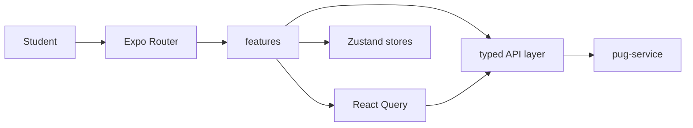

# PUG Mobile Student

> 📦 Release: **v1.0.0**

`pug-mobile-student` is the student-facing mobile application for the PUG platform. It is an Expo Router application that gives former students a focused workspace for authentication, credential setup, counterpart-hour progress, project discovery, enrollment activity, attendance creation, QR validation support, profile data, localization, and theme preferences. The repository consumes the business API exposed by `pug-service` and shares the same academic and project domain language used by the web admin and backend repositories.

## 🚀 Release 1.0.0

Release `1.0.0` marks the current stable student-app surface implemented in the repository. This version provides protected mobile routing, former-student-only token validation, credential-setup gating, persisted session recovery, home and activity dashboards, area-aware project discovery, attendance creation flows, profile and preference screens, translation tooling, Expo web export, container image publishing, and Azure Container Apps deployment workflows.

Main capabilities present in this release:

- Expo Router student workspace for the PUG mobile experience
- former-student login, refresh-token session recovery, and credential setup flow
- current-student context loading from identity and academic APIs
- home, discover, activity, attendance, attendance QR, and profile flows
- typed API layer built on Zod schemas, React Query, and backend response envelopes
- theme, locale, secure storage, and session state management
- verification, Expo web export, container image build validation, GHCR publishing, and Azure Container Apps deployment workflow

## ✨ Features

### Shared app platform

- protected and public Expo Router route groups
- former-student-only authentication guard
- password-wired gating for protected app content
- root provider stack for i18n, React Query, theme, and app context
- automatic theme and language hydration
- persisted access/refresh token storage
- localized API requests through `Accept-Language`
- reusable primitive and composite UI components

### Authentication

- login flow
- refresh-token session bootstrap
- credential wiring flow for first-access accounts
- logout and logout-all flows
- invalid-session handling and local session cleanup
- token validation restricted to `FORMER_STUDENT` accounts

### Home

- counterpart-hours summary
- student progress card
- active and pending enrollment metrics
- attendance activity snapshot
- quick actions for discovery, activity, profile, and latest QR access

### Discover

- area-of-expertise-based project discovery
- availability-aware project search
- exclusion of projects with ongoing student enrollments
- local filter sheet for status and partner-entity filtering
- empty, loading, and error states for student discovery flows

### Activity

- enrollment activity views
- attendance activity views
- project-linked detail navigation
- status-aware cards and summaries for student history

### Attendance

- attendance creation for approved enrollments
- duration input and validation
- QR detail flow after attendance creation
- attendance detail screens and status presentation

### Profile

- student identity, account, academic, course, and area data
- active account status display
- language preference switching
- theme preference switching
- sign-out controls

## 🏗️ Architecture overview

At a high level, `pug-mobile-student` is an Expo Router application organized around app routes, feature screens, typed API modules, shared UI components, schemas, stores, and utilities. The mobile app calls `pug-service` directly through the configured `EXPO_PUBLIC_API_URL`, while local app state is split between React Query for server data and Zustand stores for session, current student context, theme, and locale.

Core layers:

- **App shell and routes:** `app/`, `root-layout/`
- **Feature screens:** `features/`
- **Typed API layer:** `api/`
- **Runtime schemas:** `schemas/`
- **Client state:** `stores/`
- **Shared UI:** `components/`
- **Theme and styling:** `styles/`, `contexts/`
- **Localization:** `i18n/`, `locales/`



Important architectural properties:

- the application is scoped to the former-student experience rather than admin operations
- auth tokens are validated locally before the session is accepted into app state
- credential setup is treated as an authenticated-but-restricted state
- React Query owns backend resource fetching, cache invalidation, and mutation coordination
- Zustand owns long-lived client state such as auth, current former-student context, locale, and theme
- Zod schemas validate request and response shapes at the API boundary
- `EXPO_PUBLIC_API_URL` is injected into Expo web builds and Docker image builds
- the Docker image exports the Expo web build and serves it through Nginx

## 🧰 Tech stack

- **Framework:** Expo SDK 54 + Expo Router 6
- **Language:** TypeScript
- **UI runtime:** React 19 + React Native 0.81
- **Navigation:** Expo Router + React Navigation
- **Client data:** TanStack React Query
- **State:** Zustand
- **Forms and validation:** React Hook Form + Zod
- **Localization:** i18next + `react-i18next`
- **Storage:** Expo SecureStore through shared storage utilities
- **UI components:** React Native Paper, Lucide React Native, Expo Vector Icons
- **Styling:** React Native StyleSheet-based component styles and theme tokens
- **Containerization:** Docker multi-stage build with Expo web export served by Nginx
- **Verification/tooling:** ESLint, Prettier, TypeScript compiler, translation scripts, Expo web export
- **CI/CD tooling:** GitHub Actions
- **Registry:** GitHub Container Registry / GHCR
- **Deployment target:** Azure Container Apps

## ▶️ Getting started

### Prerequisites

- Node.js `22` recommended to match CI
- npm
- a reachable backend at `EXPO_PUBLIC_API_URL`, such as `pug-service` or a mock API
- Android Studio and/or Xcode when running native simulators locally

### Setup

Install dependencies:

```bash
npm ci
```

Create local environment configuration by setting `EXPO_PUBLIC_API_URL`, or run with the provided mock-oriented environment file.

### Environment variables

Repository-defined values:

| Variable              | Default / source                              | Purpose          |
| --------------------- | --------------------------------------------- | ---------------- |
| `EXPO_PUBLIC_API_URL` | runtime env, fallback `http://localhost:8080` | backend base URL |
| `MOCK_API_HOST`       | `mock-api.env` -> `0.0.0.0`                   | mock API host    |
| `MOCK_API_PORT`       | `mock-api.env` -> `8090`                      | mock API port    |
| `MOCK_API_VERBOSE`    | `mock-api.env` -> `true`                      | mock API logging |

Mock-oriented environment file:

- [mock-api.env](mock-api.env) sets `EXPO_PUBLIC_API_URL=http://localhost:8090`

### Local run

Start the standard Expo development server:

```bash
npm run dev
```

Start against the mock backend environment:

```bash
npm run dev:mock
```

Run on Android:

```bash
npm run android
```

Run on iOS:

```bash
npm run ios
```

Run the web target:

```bash
npm run web
```

Useful local commands:

```bash
npm run verify
npm run lint
npm run format:check
npm run build:web
```

## 📦 Version 1.0.0 Notes

- **Initial stable release:** this README documents the current `pug-mobile-student` repository as release `1.0.0`
- **Main delivered modules/features:** protected student shell, former-student auth/session handling, credential setup, home dashboard, project discovery, enrollment and attendance activity, attendance creation, QR detail flow, profile, theme, and locale preferences
- **CI/CD capabilities:** verification, image build validation, GHCR publishing, and Azure Container Apps deployment through reusable workflows
- **Known limitations visible in the repo:**
  - a dedicated automated test suite is not part of the repository
  - native EAS build, TestFlight, and app-store deployment workflows are not currently part of the repository
  - the container workflow publishes the Expo web export, not a native Android or iOS binary
  - the Android package is currently configured as `com.anonymous.pugmobilestudent`
- **Compatibility/runtime expectations:**
  - Node.js `22` is the safest local choice because it matches CI
  - the app expects a backend reachable through `EXPO_PUBLIC_API_URL`
  - Expo web export is served by Nginx on port `80` in the production container
  - the local Expo dev server uses port `3001` in repository scripts

## 🗂️ Project structure

```text
pug-mobile-student/
├── .github/
│   └── workflows/
├── api/
│   ├── academic/
│   ├── geo/
│   ├── identity/
│   ├── partner/
│   └── project/
├── app/
│   ├── (protected)/
│   └── (public)/
├── components/
├── constants/
├── contexts/
├── features/
├── hooks/
├── i18n/
├── locales/
├── public/
├── root-layout/
├── schemas/
├── scripts/
├── stores/
├── styles/
├── types/
├── utils/
├── app.json
├── Dockerfile
└── package.json
```

## 🔗 Links to related documentation

- [Expanded workspace documentation](https://github.com/Plataforma-Universidade-Gratuita/pug-docs/blob/main/pug-mobile-student/README.md)
- [Architecture notes](https://github.com/Plataforma-Universidade-Gratuita/pug-docs/blob/main/pug-mobile-student/ARCHITECTURE.md)
- [Development notes](https://github.com/Plataforma-Universidade-Gratuita/pug-docs/blob/main/pug-mobile-student/DEVELOPMENT.md)
